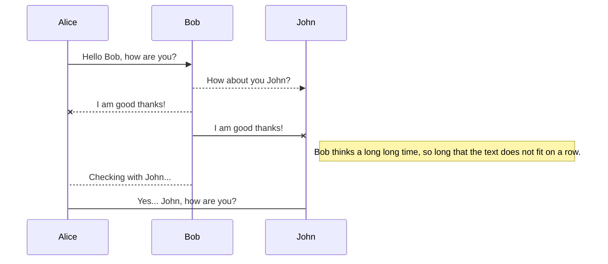

<h1 align=center>ChatGPT-Prompts</h1>
<h3 align=center>Prompt Engineering from my imagination</h3>

***
**SVG generator with preview:**
+ **prompt:** (use once if directly used on [chat.openai.com](https://chat.openai.com))
  ```prompt
  generate svg code for [INPUT]

  show OUTPUT in markdown, without backticks, without "`"

  Use this example :
  ! [](https://svg-cdn.vercel.app?svg=*)

  replace * with svg code
  
  I am providing INPUT
  I want preview OUTPUT and it in this format '! [](https://svg-cdn.vercel.app?svg=*)
  
  Do you understand?
  ```

+ **use:** (use it mulyiple times if prompt is used before else use it with prompt)
  ```markdown
   Input: sin wave changing color
  ```
  
+ **output:** (generated automatically)
  ***
  Here is the SVG code for a sine wave changing color:
  ```
   <svg xmlns="http://www.w3.org/2000/svg" viewBox="0 0 500 100">
     <defs>
       <linearGradient id="gradient">
         <stop offset="0%" stop-color="blue"/>
         <stop offset="50%" stop-color="green"/>
         <stop offset="100%" stop-color="red"/>
       </linearGradient>
     </defs>
     <path d="M 0 50 Q 25 40 50 50 Q 75 60 100 50 Q 125 40 150 50 Q 175 60 200 50 Q 225 40 250 50 Q 275 60 300 50 Q 325 40 350 50 Q 375 60 400 50 Q 425 40 450 50 Q 475 60 500 50" stroke="url(#gradient)" stroke-width="3" fill="none"/>
   </svg>
  ```

  And here is the output in markdown format:
  %22%20stroke-width%3D%223%22%20fill%3D%22none%22%2F%3E%0A%3C%2Fsvg%3E)
  ***
***
**Differance generator with preview:**
+ **prompt:** (use once if directly used on [chat.openai.com](https://chat.openai.com))
  ```prompt
   generate differance between [option1] and [option2]
   multiple points

   show OUTPUT in markdown with table format

   I am providing INPUT
   I want differance in OUTPUT

   Do you understand?
  ```

+ **use:** (use it mulyiple times if prompt is used before else use it with prompt)
  ```markdown
   Option 1: Markup
   Option 2: Markdown
  ```
  
+ **output:** (generated automatically)
  ***
  Great, here's a comparison table highlighting the differences between Markup and Markdown:

  |     | Markup | Markdown |
  | --- | ------ | -------- |
  | Purpose | Used to format text for print or digital media | Used to format text for web-based platforms |
  | Syntax | Uses HTML tags and attributes | Uses plain text characters |
  | Learning Curve | Steep | Easy to learn |
  | Ease of Use | Complex | Simple |
  | Formatting | Formatting options are more extensive | Formatting options are limited |
  | Portability | Not as portable across different platforms | Highly portable across different platforms |
  | Widely Used In | Adobe Photoshop, InDesign, QuarkXPress, etc. | GitHub, Reddit, Stack Overflow, etc. |

  Hope this helps! Let me know if you need any further information.
  ***
***

**Dos and don'ts generator with preview:**
+ **prompt:** (use once if directly used on [chat.openai.com](https://chat.openai.com))
  ```prompt
   generate "dos and don'ts" for [topic]

   show OUTPUT in markdown with checkmarks like [x] for dos and [] for don'ts

   I am providing INPUT
   I want points with checkmarks in OUTPUT

   Do you understand?
  ```

+ **use:** (use it mulyiple times if prompt is used before else use it with prompt)
  ```markdown
   Topic: ai
  ```
  
+ **output:** (generated automatically)
  ***
  Sure, here's your "dos and don'ts" list for AI:

  + Dos

    - [x] Do understand the basics of AI and its limitations before implementing it in any application.
    - [x] Do ensure that the AI system is transparent and explainable, so that users can understand how the system is making decisions.
    - [x] Do ensure that the AI system is secure and free from any biases or prejudices that may affect the accuracy of its decisions.
    - [x] Do consider the ethical implications of AI and how it can be used to benefit society as a whole.
    - [x] Do use AI to automate repetitive and mundane tasks, freeing up time for more important work.
    - [x] Do ensure that the AI system is reliable and robust, with proper error handling mechanisms in place.
    - [x] Do test the AI system thoroughly before deploying it in a production environment.
    - [x] Do keep the AI system up-to-date with the latest security patches and updates.
    - [x] Do ensure that the AI system complies with all applicable laws and regulations.

  + Don'ts

    - [ ] Don't implement AI blindly without understanding its potential drawbacks and limitations.
    - [ ] Don't use AI to replace human judgment and decision-making entirely.
    - [ ] Don't rely solely on AI for critical tasks without any human oversight or intervention.
    - [ ] Don't use AI to perpetuate biases or prejudices, as this can lead to inaccurate and unfair decisions.
    - [ ] Don't assume that AI is infallible or foolproof, as it can still make mistakes and errors.
    - [ ] Don't neglect to train and educate employees on how to use and interact with AI systems.
    - [ ] Don't deploy an AI system without a proper disaster recovery plan in place.
    - [ ] Don't collect or use personal data without proper consent and protection measures in place.
    - [ ] Don't use AI for unethical purposes, such as surveillance or manipulation.
  ***
***
**Formula generator with preview:**
+ **prompt:** (use once if directly used on [chat.openai.com](https://chat.openai.com))
  ```prompt
   Give formula of [formula]

   in markdown format with in $$
   example: $$*$$
   Replace * with formula

   I am providing input
   I want only preview in markdown

   Do you understand?
  ```

+ **use:** (use it mulyiple times if prompt is used before else use it with prompt)
  ```markdown
   Formula: pythagoras with root
  ```
  
+ **output:** (generated automatically)
  ***
  Sure! The Pythagorean theorem with the square root is given by:

  ```
   $$c = \sqrt{a^2 + b^2}$$
  ```

  This will render as:

  $$c = \sqrt{a^2 + b^2}$$

  where `a` and `b` are the lengths of the two legs of a right triangle and `c` is the length of the hypotenuse.
  ***
***

<!--



-->
